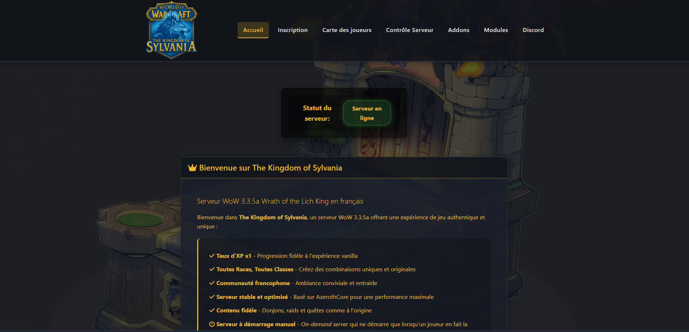
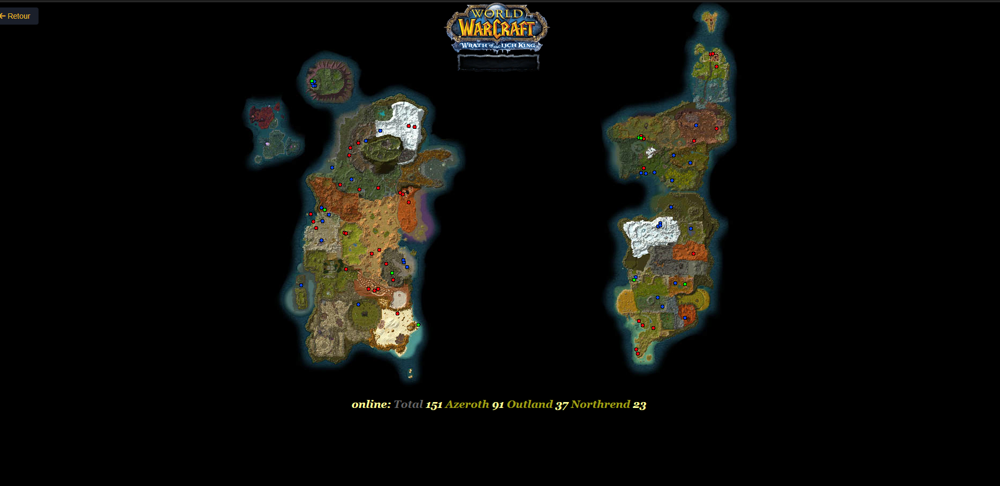

# Site Web The Kingdom of Sylvania - WoW 3.3.5a

## À propos
Site web officiel pour le serveur privé WoW The Kingdom of Sylvania, basé sur AzerothCore 3.3.5a (Wrath of the Lich King).

## Fonctionnalités
- Système d'inscription et de gestion de compte
- Contrôle serveur (démarrage/arrêt) pour les administrateurs
- Statistiques des joueurs et classements
- Information sur les modules personnalisés (ARAC, Transmog, SoloCraft, etc.)
- Téléchargement de patches et fichiers clients

### Carte des joueurs

### Contrôle Serveur

## Modules Serveur
- **ARAC** (All Races All Classes) - Permet à toutes les races de jouer toutes les classes
- **Transmog** - Modification de l'apparence des équipements
- **SoloCraft** - Ajustement des statistiques pour les donjons/raids solo
- **Premium** - Fonctionnalités supplémentaires (banque mobile, hôtel des ventes mobile...)
- **Random Enchants** - Enchantements aléatoires sur les objets

## Installation
1. Cloner ce dépôt sur votre serveur web
2. Configurer les fichiers dans le dossier `config/`
3. Créer les tables nécessaires dans la base de données MySQL
4. Configurer le serveur web pour pointer vers ce dossier

## Accès
- **Discord** : [Serveur Discord Officiel](https://discord.gg/znmcNmXbQw)

## Configuration requise
- PHP 7.0 ou supérieur
- MySQL 5.7 ou supérieur
- Extension PHP MySQLi
- Extension PHP GD (pour les images)

## Credits
- Basé sur AzerothCore (https://www.azerothcore.org/)
- Interface de contrôle serveur par The Kingdom of Sylvania
